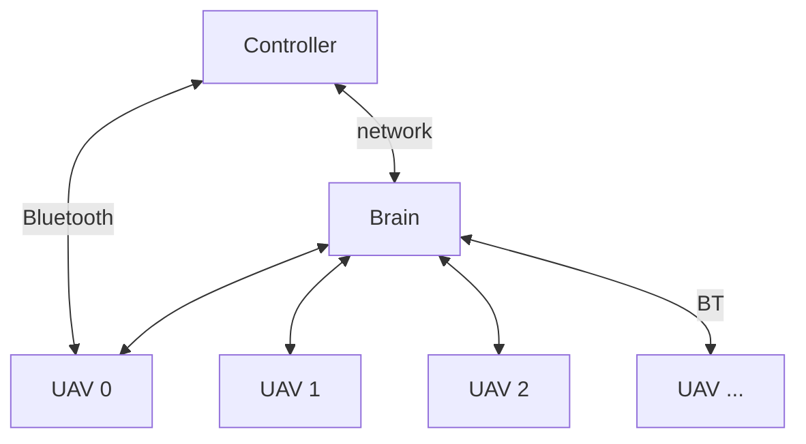
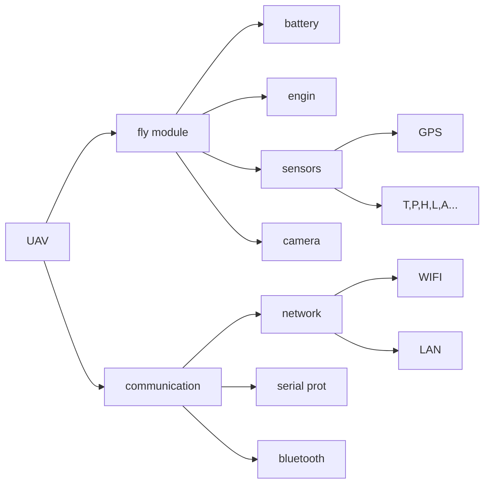

# Documents
## system struct


## UAC struct


## procotol
Using type json for data exchange.like following e.g.

```json
{
    "sender":{
        "id":0xff4899, // using mac address of controller
        "type":"controller" // controller ,uav or brain
        "name":"mi 13", // or uav
    },
    "recipient":{
        "id":0xce337fda, // using mac address of controller
        "type":"uav"
        "name":"controller", // or uav
    },
    "type":"cmd", // cmd ,recv or notif 
    "stamp":1234567890, // timestamp if recv ,must use same stamp
}
```
### cmd table
|functions|cmd|sender|recipient|send data|recv data|comment
|----|----|----|----|----|----|----|
communication check |0  |any    |any    |"syscheck"  |"syscheck"|
query all uav info  |1|any|brain/uav|none|list[[id,name,type],]
change position by direction delta|2|true/false|any|uav|[dx,dy,dz]
get the GPS position|3|any|uav|...|...
get speed       |4  |any    |uav    |none    |[x,y,z] unit:m/s|
get the height  |5  |any    |uav    |none    |[z] unit:m|


